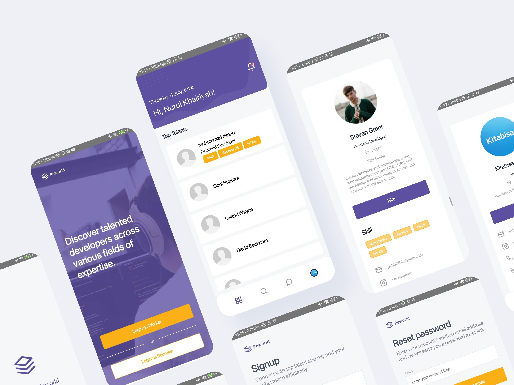
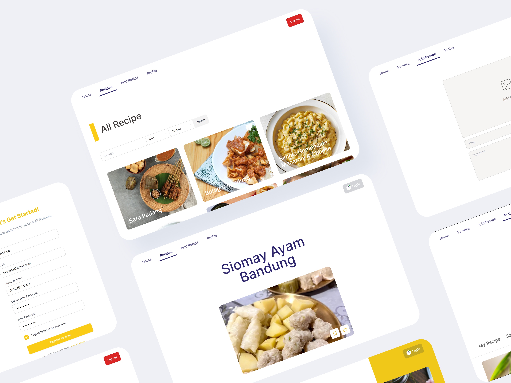
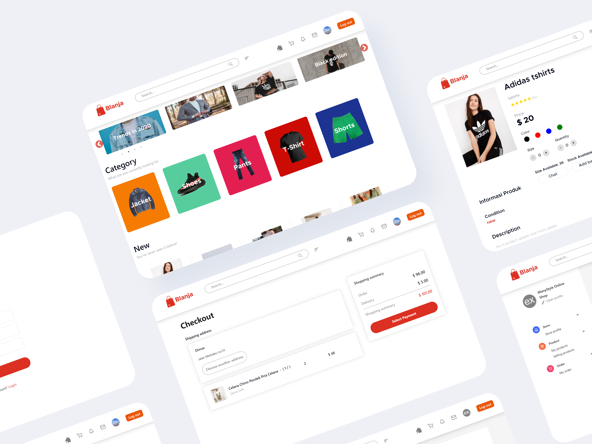

<a id="readme-top"></a>

<br />
<div align="center">
  <a href="https://github.com/naufandarmawan/peworld-be">
    
  </a>

  <h3 align="center">Peworld</h3>
  <p align="center">
    Job Placement Platform (Web Application) 
  </p>
</div>


<details>
  <summary>Table of Contents</summary>
  <ol>
    <li>
      <a href="#about-the-project">About The Project</a>
      <ul>
        <li><a href="#built-with">Built With</a></li>
        <li><a href="#features">Features</a></li>
        <li><a href="#project-structure">Project Structure</a></li>
      </ul>
    </li>
    <li>
      <a href="#getting-started">Getting Started</a>
      <ul>
        <li><a href="#prerequisites">Prerequisites</a></li>
        <li><a href="#installation">Installation</a></li>
        <li><a href="#development">Development</a></li>
        <li><a href="#production">Production</a></li>
      </ul>
    </li>
    <li><a href="#contributing">Contributing</a></li>
    <li><a href="#related-projects">Related Projects</a></li>
    <li><a href="#license">License</a></li>
    <li><a href="#contact">Contact</a></li>
  </ol>
</details>


## About The Project

In response to industry demands, where 72% of companies rely on mobile applications for recruitment, Peworld Mobile provides an innovative solution to streamline the recruitment process. It allows talent to easily access the latest career opportunities anywhere, while expanding companies' reach globally.

<p align="right">(<a href="#readme-top">back to top</a>)</p>


### Built With

* Express
* PostgreSQL
* JWT
* Bcrypt
* Multer
* Cloudinary
* Nodemailer
* Sendgrid
* Git
* Vercel
* Postman

<p align="right">(<a href="#readme-top">back to top</a>)</p>


### Features

* Account creation, 
* Display and search worker listings, 
* Worker detail view, 
* Profile editing, 
* Password reset, 
* Push notifications,
* Skill management, 
* Portfolio and work experience management, 
* Profile photo upload directly from the user's camera.
* Worker hiring.


<p align="right">(<a href="#readme-top">back to top</a>)</p>


### Project Structure

```
└── 📁backend
    └── .env
    └── .env.example
    └── .eslintrc.json
    └── .gitignore
    └── eslint.config.mjs
    └── index.js
    └── package-lock.json
    └── package.json
    └── 📁queryDB
        └── basic.sql
    └── README.md
    └── 📁src
        └── 📁configs
            └── cloudinary.js
            └── db.js
            └── nodemailer.js
            └── redis.js
        └── 📁controller
            └── assets.js
            └── auth.js
            └── experience.js
            └── hire.js
            └── portfolio.js
            └── recruiters.js
            └── skill.js
            └── workers.js
        └── 📁helper
            └── auth.js
            └── common.js
            └── nodemailer.js
        └── 📁middlewares
            └── assets.js
            └── auth.js
            └── cloudinary.js
            └── redis.js
        └── 📁models
            └── assets.js
            └── auth.js
            └── experience.js
            └── hire.js
            └── portfolio.js
            └── recruiters.js
            └── skill.js
            └── workers.js
        └── 📁routes
            └── assets.js
            └── auth.js
            └── experience.js
            └── hire.js
            └── portfolio.js
            └── recruiters.js
            └── skill.js
            └── workers.js
    └── 📁uploads
    └── vercel.json
```

<p align="right">(<a href="#readme-top">back to top</a>)</p>


## Getting Started

To set up and run the project locally, follow these steps:

### Prerequisites

Before starting, make sure you have npm installed. You can install it globally using:

* npm
  ```sh
  npm install npm@latest -g
  ```

### Installation

1. Clone the repository:
   ```sh
   git clone https://github.com/naufandarmawan/peworld-be.git
   ```
2. Install dependencies:
   ```sh
   npm install
   ```
3. Set up environment variables:
   * Create a `.env` file in the root directory of your project.
   * Add your API key to the `.env` file:
   ```js
   PORT=4000
   DB_USER=your_db_user
   DB_PASSWORD=your_db_password
   DB_HOST=your_db_host
   DB_NAME=your_db_name
   DB_PORT=5432
   SECRET_KEY_JWT=your_secret_key_jwt
   CLOUDINARY_CLOUD_NAME=your_cloudinary_cloud_name
   CLOUDINARY_API_KEY=your_cloudinary_api_key
   CLOUDINARY_SECRET_KEY=your_cloudinary_secret_key
   SENDGRID_API_KEY=your_sendgrid_api_key
   SENDGRID_EMAIL=your_email@example.com
   SITE=http://localhost:4000
   ONESIGNAL_APP_ID=your_onesignal_app_id
   ONESIGNAL_API_KEY=your_onesignal_api_key
   ```
   * Replace the placeholder values with your actual environment variables.

### Development

4. Start the development server:
   ```sh
   npm run dev
   ```

### Production

5. Build the project:
   ```sh
   npm run build
   ```
6. Start the production server:
   ```sh
   npm run start
   ```

By following these steps, you'll have everything set up to run the project locally on your machine.

<p align="right">(<a href="#readme-top">back to top</a>)</p>


## Contributing

Contributions are what make the open source community such an amazing place to learn, inspire, and create. Any contributions you make are **greatly appreciated**.

If you have a suggestion that would make this better, please fork the repo and create a pull request. You can also simply open an issue with the tag "enhancement".

Don't forget to give the project a star! Thanks again!

1. Fork the Project
2. Create your Feature Branch (`git checkout -b feature/AmazingFeature`)
3. Commit your Changes (`git commit -m 'Add some AmazingFeature'`)
4. Push to the Branch (`git push origin feature/AmazingFeature`)
5. Open a Pull Request

<p align="right">(<a href="#readme-top">back to top</a>)</p>


## Related Projects

Here are some related projects and resources you may find helpful. These include demo links, backend links, and other projects from my portfolio:

* Peworld Backend Demo: [Backend Demo](https://peworld-be-naufan.vercel.app/)
* Peworld Backend Postman Documentation: [Postman Documentation Link](https://documenter.getpostman.com/view/33183013/2sA3dyhW4u)
* Peworld Frontend Demo: [Demo Link](https://peworld-fe-naufan.netlify.app/)
* Peworld Frontend Repository: [Repository Link](https://github.com/naufandarmawan/peworld-fe)
* Peworld Mobile: [Peworld Mobile Repository](https://github.com/naufandarmawan/peworld-mobile)

### My Other Portfolios

<table style="width: 100%; border-collapse: collapse;">
<colgroup>
    <col style="width: 33.33%;">
    <col style="width: 33.33%;">
    <col style="width: 33.33%;">
  </colgroup>
  <tr>
    <!-- <th style="padding: 8px; text-align: center; border: 1px solid #ddd;">Peworld Web App</th> -->
    <th style="padding: 8px; text-align: center; border: 1px solid #ddd;">Peworld Mobile App</th>
    <th style="padding: 8px; text-align: center; border: 1px solid #ddd;">MamaRecipe Web App</th>
    <th style="padding: 8px; text-align: center; border: 1px solid #ddd;">Blanja Web App</th>
  </tr>
  <tr>
    <!-- <td style="padding: 8px; text-align: left; border: 1px solid #ddd;"><a href="https://github.com/naufandarmawan/peworld-fe"></a></td> -->
    <td style="padding: 8px; text-align: left; border: 1px solid #ddd;"><a href="https://github.com/naufandarmawan/peworld-mobile"></a></td>
    <td style="padding: 8px; text-align: left; border: 1px solid #ddd;"><a href="https://github.com/naufandarmawan/mamarecipe-fe"></a></td>
    <td style="padding: 8px; text-align: left; border: 1px solid #ddd;"><a href="https://github.com/naufandarmawan/blanja-fe"></a></td>
  </tr>
  <!-- Repeat similar rows for more screenshots -->
</table>

<p align="right">(<a href="#readme-top">back to top</a>)</p>


## License

Distributed under the MIT License. See `LICENSE` for more information.

<p align="right">(<a href="#readme-top">back to top</a>)</p>


-----


<p align="center" id="contact">© Peworld 2024</p>
<p align="center">
<a href="https://github.com/naufandarmawan/"> Naufan Darmawan </a> - <a href="mailto:naufandarmawan@gmail.com">naufandarmawan@gmail.com</a> - <a href="https://www.linkedin.com/in/naufandarmawan/">LinkedIn</a>
</p>
